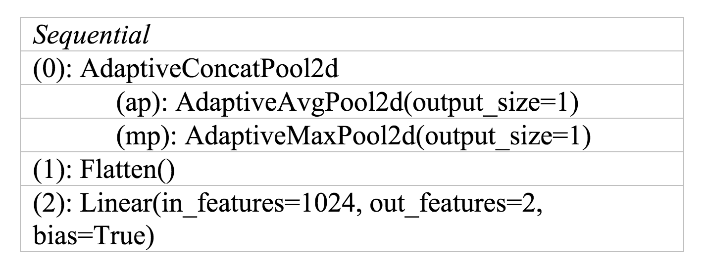

## Navigation 
- <a href = "https://connielee99.github.io/Explainable-AI-in-Finance">HomePage</a>
- <a href = "https://connielee99.github.io/Explainable-AI-in-Finance/abstract">Project Details</a>
  - <a href = "https://connielee99.github.io/Explainable-AI-in-Finance/introduction">Introduction</a>
  - <a href = "https://connielee99.github.io/Explainable-AI-in-Finance/stockmarket">Stock Market</a>
  - <a href = "https://connielee99.github.io/Explainable-AI-in-Finance/result">Prediction Result</a>
- <a href = "https://connielee99.github.io/Explainable-AI-in-Finance/methodology">Technical Methodology</a>
	- <a href = "https://connielee99.github.io/Explainable-AI-in-Finance/gaf">Gramian Angular Field</a> 
	- <a href = "https://connielee99.github.io/Explainable-AI-in-Finance/fastai">FastAI CNN Model</a>
	- <a href = "https://connielee99.github.io/Explainable-AI-in-Finance/gradcam">Grad-CAM Algorithm</a>

## Market Prediction with CNN Model using FastAI Library 

 
We used **FastAI**, a PyTorch-based deep learning library, to build the neural network, which is able to figure out the relationship between input features and find hidden relationship with them. The input data is an image dataset with labels, which is converted from time series with Gramian Angular Field algorithm as described in the previous sections.  

The entire dataset of 988 days (image instances) was divided into training and validation sets, with a 20% validation ration. Our training procedure followed the following steps. 

1. Find the optimal learning rate for the intinal layers where the numerical gradient is minimized. 

2. Train the model with the learning rate found in (1) with 10 epochs. 

3. Unfreeze the model and find the optimal learning rate for all the layers where the numerical gradient is minimized. 

4. Train the model with the learning rate found in (3) with 10 epochs. 

 
For the CNN network, the pretrained **ResNET-34** is utilized as the bottom layers. We added [1024, 2] dense layers on top and a simple linear activation node for the final regression as a custom head. The figure below shows the architecture of the top layers of the model. For the loss function, our final model used cross-entropy loss. For the model metrics, we used accuracy. 

    
     The Top Layers of Our CNN Learner