## Navigation 
- <a href = "https://connielee99.github.io/Explainable-AI-in-Finance">HomePage</a>
- <a href = "https://connielee99.github.io/Explainable-AI-in-Finance/abstract">Project Details</a>
  - <a href = "https://connielee99.github.io/Explainable-AI-in-Finance/introduction">Introduction</a>
  - <a href = "https://connielee99.github.io/Explainable-AI-in-Finance/stockmarket">Stock Market</a>
  - <a href = "https://connielee99.github.io/Explainable-AI-in-Finance/result">Prediction Result</a>
- <a href = "https://connielee99.github.io/Explainable-AI-in-Finance/methodology">Technical Methodology</a>
	- <a href = "https://connielee99.github.io/Explainable-AI-in-Finance/gaf">Gramian Angular Field</a> 
	- <a href = "https://connielee99.github.io/Explainable-AI-in-Finance/fastai">FastAI CNN Model</a>
	- <a href = "https://connielee99.github.io/Explainable-AI-in-Finance/gradcam">Grad-CAM Algorithm</a>

## Gradient-Weighted Class Activation Map

	Grad-CAM is an “Explainable AI” technique developed in 2016 by Selvaraju et al. It is introduced with a primary goal of boosting confidence in applying neural networks – making it possible for visual analysis on misclassified instances for detecting discrepancies. By “producing ‘visual explanations’ for decisions from large class of CNN-based models, making them more transparent”, Grad-CAM helps people better understand a wide range of tasks, including image classification, image captioning, and visual question answering models, etc. (Selvaraju et al.).

Briefly summarizing the working process of Grad-CAM (see Figure 2): given a picture and a class as input, Grad-CAM forward-propagates the image through the network model to get raw class scores before the Softmax layer (Selvaraju et al.). A gradient signal with only the inputted class set to 1 and others to 0 is then back-propagated to the rectified Conv feature maps – where coarse localization is calculated and a heatmap is generated (Selvaraju et al.). Finally, the pointwise multiplications of this heatmap and guided backpropagation produces Guided Grad-CAM visualizations (Selvaraju et al.).

 
	<b>Grad-CAM Architecture</b> 
  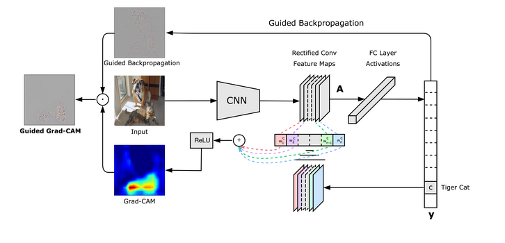
   Published by: <a href="https://arxiv.org/abs/1610.02391">Ramprasaath R. Selvaraju, et.al.,</a>

This section summarizes results generated by applying the Grad-CAM Algorithm over our Gramian Angular Field converted time series data.  

Results shown below are made available by leveraging third-party Grad-CAM API instead of using Grad-CAM algorithm we trained ourselves (<a href = https://github.com/kazuto1011/grad-cam-pytorch#demo-1>Source</a>). This interface is favored over ours due to it enabling additional visualizations for inspection – that include Guided Grad-CAM, gradients by vanilla backpropagation, gradients by guided backpropagation, and gradients by deconvnet. Trained on a different image database but sharing the same internal architecture of ResNet-34, we specify the target layer, i.e., layer4 in the algorithm for visualization. For there are only two classes in our prediction task, outputs on only the top 1 class of two sample images are generated. 

| Predicted Class = 1 | GAF Image: 2017-01-03 | GAF Image: 2021-01-01 |
| --- | --- | --- |
| Original Image | 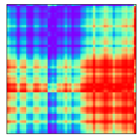 | 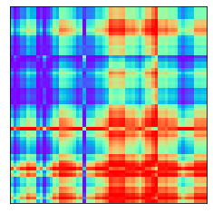 |
| Grad-CAM | 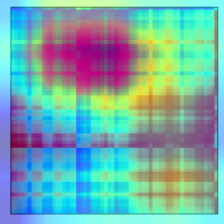 | 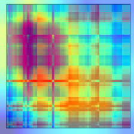 |
| Vanilla Backpropagation | 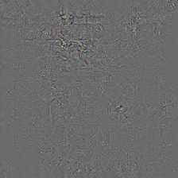 | 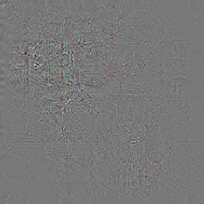 |
| DeconvNet | 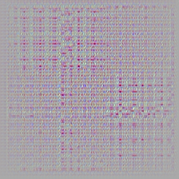 | 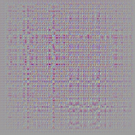 |
| Guided Backpropagation | 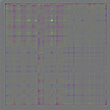 | 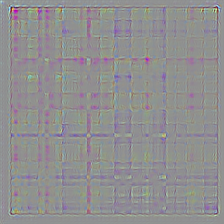 |
| Guided Grad-CAM | 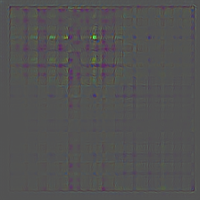 | 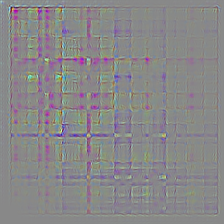 |
