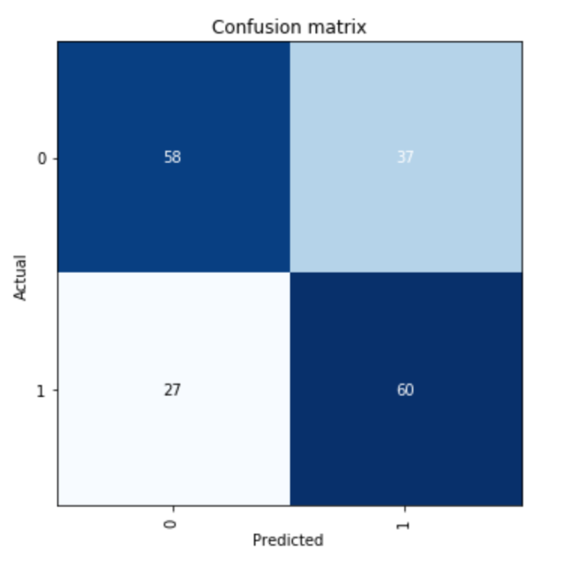
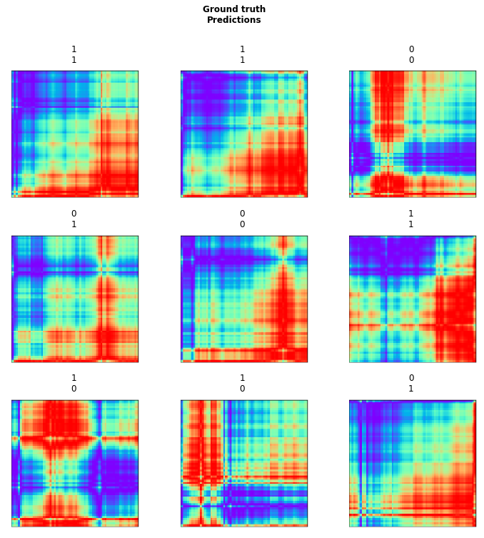
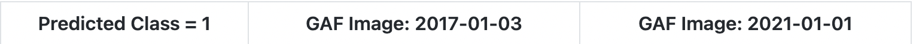
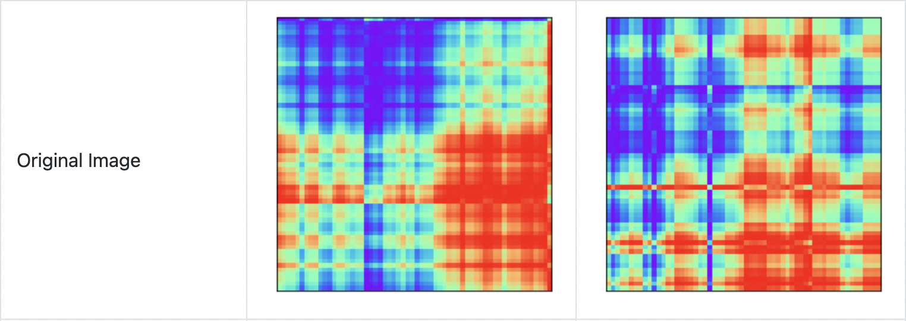
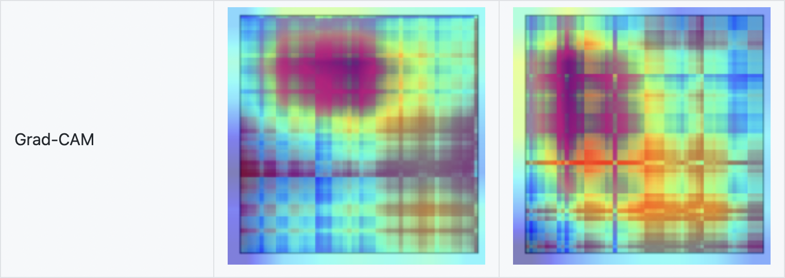
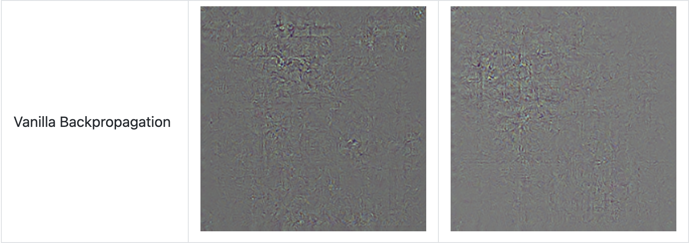
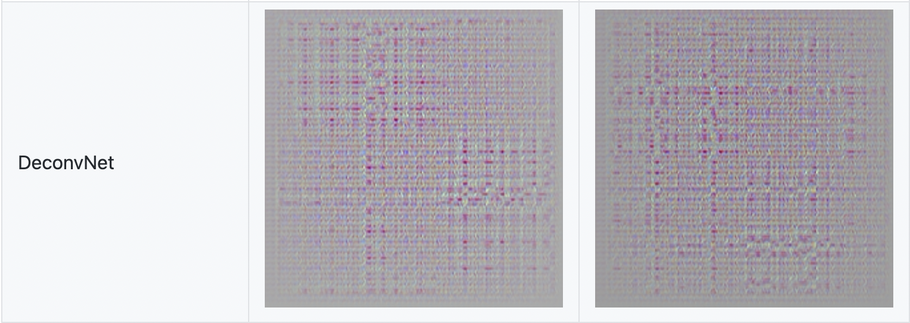
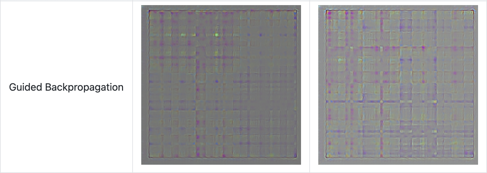
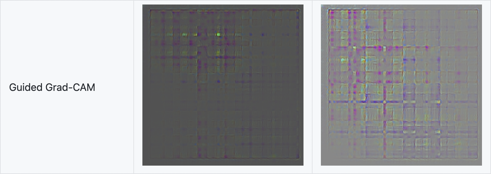

## Navigation 
- <a href = "https://connielee99.github.io/Explainable-AI-in-Finance">HomePage</a>
- <a href = "https://connielee99.github.io/Explainable-AI-in-Finance/abstract">Project Details</a>
  - <a href = "https://connielee99.github.io/Explainable-AI-in-Finance/introduction">Introduction</a>
  - <a href = "https://connielee99.github.io/Explainable-AI-in-Finance/stockmarket">Stock Market</a>
  - <a href = "https://connielee99.github.io/Explainable-AI-in-Finance/result">Prediction Result</a>
- <a href = "https://connielee99.github.io/Explainable-AI-in-Finance/methodology">Technical Methodology</a>
	- <a href = "https://connielee99.github.io/Explainable-AI-in-Finance/gaf">Gramian Angular Field</a> 
	- <a href = "https://connielee99.github.io/Explainable-AI-in-Finance/fastai">FastAI CNN Model</a>
	- <a href = "https://connielee99.github.io/Explainable-AI-in-Finance/gradcam">Grad-CAM Algorithm</a>

## Model Training Results

After the training procedure described above, the CNN model constantly achieves around **62% accuracy** on the validation set. The figure below shows the confusion matrix of our final model. We can observe that the model works quite equally for both of the two classes with the false positive rate being a little bit higher than the false negative rate.

    
     
	The Confusion Matrix of the Final Model
	

The figure below are some sample instances from the validation results. Again, the class “1” means the index price went up that given day and the class “0” indicates the opposite.
    

    
     Prediction Results for Some Instance in Validation Set
	

## Grad CAM Results

This section summarizes results generated by applying the Grad-CAM Algorithm over our Gramian Angular Field converted time series data.  

Results shown below are made available by leveraging third-party Grad-CAM API instead of using Grad-CAM algorithm we trained ourselves (<a href = "https://github.com/kazuto1011/grad-cam-pytorch#demo-1">Source</a>). This interface is favored over ours due to it enabling additional visualizations for inspection – that include Guided Grad-CAM, gradients by vanilla backpropagation, gradients by guided backpropagation, and gradients by deconvnet. Trained on a different image database but sharing the same internal architecture of ResNet-34, we specify the target layer, i.e., layer4 in the algorithm for visualization. For there are only two classes in our prediction task, outputs on only the top 1 class of two sample images are generated. 

<b>Visual Explanation from Various Algorithms</b> 

The following have Predicted Class = 1, and are each of GAF images from 2017-01-03 and 2021-01-01

 
 
 
 
 
 
 

Brief description of each visual explanation (Definitions from <a href = "https://glassboxmedicine.com/2019/06/21/cnn-heat-maps-saliency-backpropagation>Source">Source</a>  
	
- Grad-CAM – “uses the class-specific gradient information flowing into the final convolutional layer of a CNN to produce a coarse localization map of the important regions in the image”.   
- Vanilla Backpropagation – or Gradients, “commonly referred to as saliency maps’ or ‘backpropagation” (Draelos). It is a “visualization of an image in which the most salient/most important pixels are highlighted”.   
- DeconvNets – “DeconvNets are the same as the “Gradients” approach except for a difference in backpropagation through the ReLU nonlinearity”.   
- Guided Backpropagation – or Guided Saliency, “combines vanilla backpropagation and DeconvNets when handling the ReLU nonlinearity”.   
- Guided Grad-CAM – “This is an element-wise product of GradCAM with Guided Backpropagation”.   
	
The visual explanation maps seem to all be suggesting that information towards the top-left corner is comparably more important than that of the rest. This can be seen from patterns exhibited in results generated by Vanilla Backpropagation, DeconvNet, and Guided Backpropagation. The same is even more apparent from that in Grad-CAM: judging by the colors from heatmap mapped on top of the gramian angular fields, the red color -- signifying “visualizing ‘the most important information’” – are both present towards the top-left corner. Guided Grad-CAM shows similar results with more enhanced presence.   

To explain this result, we recall the key characteristic of Gramian Angular Field – it preserves temporal dependencies of time series as the position moves from the top-left corner to the bottom-right. Keeping this in mind while further inspecting visual explanations on all generated images, it is discovered that areas spanning the entire middle portion (from left to right) of Gramian Angular Fields seem to be most frequently highlighted. In relation to our original time series, this means that trades that happen during the middle of the hour of the trading period gives comparably more importance on predicting price “increase” or “decrease” than the rest of the daily entries. 

