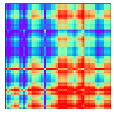
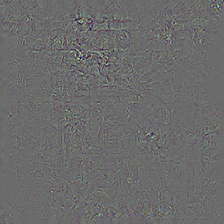
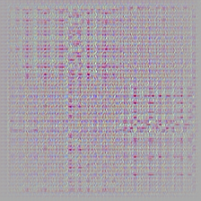
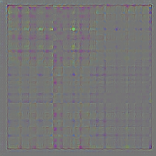
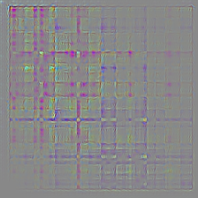

## Navigation 
- <a href = "https://connielee99.github.io/Explainable-AI-in-Finance">HomePage</a>
- <a href = "https://connielee99.github.io/Explainable-AI-in-Finance/abstract">Project Details</a>
  - <a href = "https://connielee99.github.io/Explainable-AI-in-Finance/introduction">Introduction</a>
  - <a href = "https://connielee99.github.io/Explainable-AI-in-Finance/stockmarket">Stock Market</a>
  - <a href = "https://connielee99.github.io/Explainable-AI-in-Finance/result">Prediction Result</a>
- <a href = "https://connielee99.github.io/Explainable-AI-in-Finance/methodology">Technical Methodology</a>
	- <a href = "https://connielee99.github.io/Explainable-AI-in-Finance/gaf">Gramian Angular Field</a> 
	- <a href = "https://connielee99.github.io/Explainable-AI-in-Finance/fastai">FastAI CNN Model</a>
	- <a href = "https://connielee99.github.io/Explainable-AI-in-Finance/gradcam">Grad-CAM Algorithm</a>

## Model Training Results

After the training procedure described above, the CNN model constantly achieves around **62% accuracy** on the validation set. The figure below shows the confusion matrix of our final model. We can observe that the model works quite equally for both of the two classes with the false positive rate being a little bit higher than the false negative rate.

    
     The Confusion Matrix of the Final Model

The figure below are some sample instances from the validation results. Again, the class “1” means the index price went up that given day and the class “0” indicates the opposite.
    

    
     Prediction Results for Some Instance in Validation Set
	

## Grad CAM Results

This section summarizes results generated by applying the Grad-CAM Algorithm over our Gramian Angular Field converted time series data.  

Results shown below are made available by leveraging third-party Grad-CAM API instead of using Grad-CAM algorithm we trained ourselves (<a href = https://github.com/kazuto1011/grad-cam-pytorch#demo-1>Source</a>). This interface is favored over ours due to it enabling additional visualizations for inspection – that include Guided Grad-CAM, gradients by vanilla backpropagation, gradients by guided backpropagation, and gradients by deconvnet. Trained on a different image database but sharing the same internal architecture of ResNet-34, we specify the target layer, i.e., layer4 in the algorithm for visualization. For there are only two classes in our prediction task, outputs on only the top 1 class of two sample images are generated. 

<b>Visual Explanation from Various Algorithms </b>

| Predicted Class = 1 | GAF Image: 2017-01-03 | GAF Image: 2021-01-01 |
| --- | --- | --- |
| Original Image |  |  |
| Grad-CAM |  |  |
| Vanilla Backpropagation |  |  |
| DeconvNet |  |  |
| Guided Backpropagation |  |  |
| Guided Grad-CAM |  |  |
